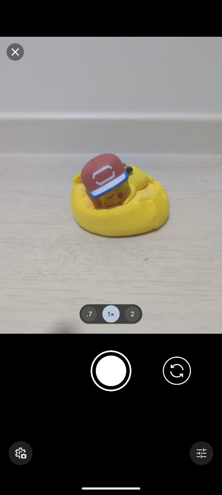
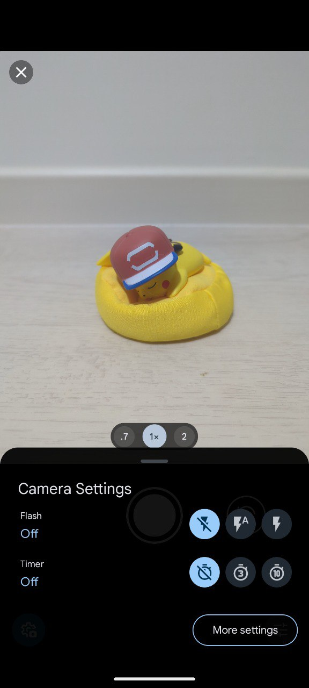
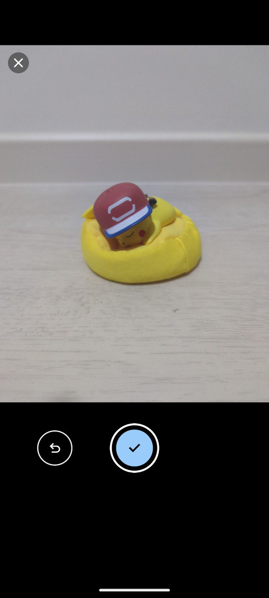
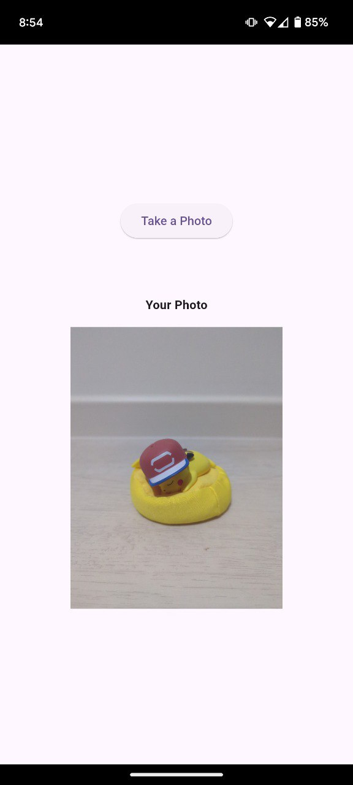

# flutter_android_camera

A simple app that uses Flutter Method Channels to dispatch an Android `MediaStore.ACTION_IMAGE_CAPTURE` intent to capture a photo via the native Android camera. The captured photo is saved and its path is returned to Flutter for the purpose of displaying the image.

## Relevant working files

- lib/main.dart
- android/app/src/main/kotlin/com/example/flutter_android_camera/MainActivity.kt
- android/app/src/main/AndroidManifest.xml

```
<uses-permission android:name="android.permission.CAMERA" />
<uses-feature android:name="android.hardware.camera" />
<uses-feature android:name="android.hardware.camera.autofocus" />
```

```
<provider
    android:name="androidx.core.content.FileProvider"
    android:authorities="${applicationId}.provider"
    android:exported="false"
    android:grantUriPermissions="true">
    <meta-data
        android:name="android.support.FILE_PROVIDER_PATHS"
        android:resource="@xml/provider_paths" />
</provider>
```

- android/app/src/main/res/xml/provider_paths.xml

```
<?xml version="1.0" encoding="utf-8"?>
<paths>
    <external-path name="external_files" path="."/>
</paths>
```

## Screenshots

<p float="left">
  
  
  
  
  
</p>
